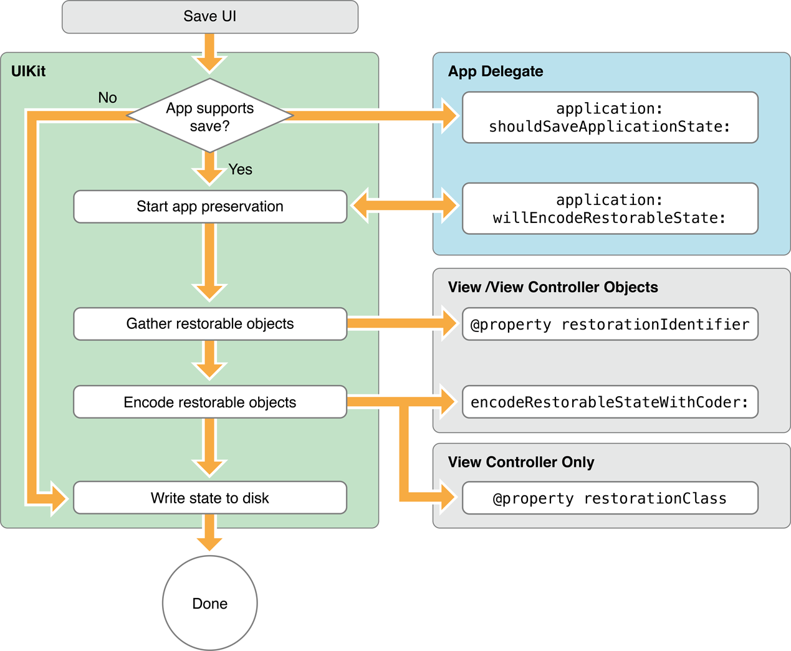

# 应用状态保存和恢复

资料来自官方文档 [*Preserving Your App’s Visual Appearance Across Launches*](https://developer.apple.com/library/ios/documentation/iPhone/Conceptual/iPhoneOSProgrammingGuide/StrategiesforImplementingYourApp/StrategiesforImplementingYourApp.html#//apple_ref/doc/uid/TP40007072-CH5-SW2)。

- [保存和恢复过程](#The_Preservation_and_Restoration_Process)
	- [保存流程](#Flow_of_the_Preservation_Process)
	- [恢复流程	](#Flow_of_the_Restoration_Process)
- [未设置恢复标识符的情况](#What_Happens_When_You_Exclude_Groups_of_View_Controllers)
- [实现状态保存和恢复功能的核对清单](#Checklist_for_Implementing_State_Preservation_and_Restoration)
- [在应用中启用状态保存和恢复功能](#Enabling_State_Preservation_and_Restoration_in_Your_App)
- [保存视图控制器的状态](#Preserving_the_State_of_Your_View_Controllers)
	- [为需要保存状态的视图控制器设置恢复标识符](#Marking_Your_View_Controllers_for_Preservation)
	- [在启动时恢复视图控制器](#Restoring_Your_View_Controllers_at_Launch_Time)
	- [编码和解码视图控制器的状态](#Encoding_and_Decoding_Your_View_Controller’s_State)
- [保存视图的状态](#Preserving_the_State_of_Your_Views)	- [会保存状态的 UIKit 视图](#UIKit_Views_with_Preservable_State)
	- [保存自定义视图的状态](#Preserving_the_State_of_a_Custom_View)
	- [实现能应对变化的数据源](#Implementing_Preservation_Friendly_Data_Sources)
- [保存应用级别的状态](#Preserving_Your_App’s_High_Level_State)
- [状态保存和恢复小贴士](#Tips_for_Saving_and_Restoring_State_Information)

即使应用支持后台运行，它也不能永远运行。在某些时候，系统可能需要终止后台运行的应用，从而为前台运行的应用释放更多内存。但是，用户应该不必关心应用是否还在后台运行或是已经被终止。从用户角度来看，退出应用应该只是暂时性地中断。当用户返回应用时，应用应该总是呈现出用户退出前的样子，这样，用户就可以继续先前未完成的任务。这种行为将为用户提供更好的用户体验，使用 `UIKit` 所支持的状态恢复机制可以相对容易地实现这种行为。

<a name="The_Preservation_and_Restoration_Process"></a>
## 保存和恢复过程

启用状态保存和恢复功能后，指定了 `restorationIdentifier` 属性的视图控制器和视图的状态会被系统自动保存和恢复。从 `iOS 7` 开始，实现了 `UIStateRestoring` 协议的对象，并使用 `+[UIApplication(UIStateRestoration) registerObjectForStateRestoration:restorationIdentifier:]` 方法注册后，也可以手动支持状态保存和恢复。系统不会自动保存和恢复这类对象，可以在视图控制器或视图的保存和恢复方法中编码和解码这类对象。

系统会在适当的时机，例如，当应用由前台进入后台时，查找指定了恢复标识符的视图控制器和视图，并将相关状态数据保存到加密的文件中。当应用下次启动时，系统会查找该文件，并尝试用该文件来恢复应用的状态。由于文件是加密的，保存和恢复过程只会发生在设备解锁的情况下。

在恢复过程中，系统会使用状态恢复文件中的数据来重新建立用户界面，开发者则负责提供相应的视图控制器。之后，系统会根据保存的状态信息对相关视图控制器和视图进行恢复。

由于系统会完成绝大部分工作，开发者只需负责少量工作：

- 在保存过程中：
	- 表明该应用支持状态保存。
	- 表明哪些视图控制器和视图需要保存状态。
	- 编码保存额外的相关数据，例如文本框内容。

- 在恢复过程中：
	- 表明该应用支持状态恢复
	- 提供相关的视图控制器。
	- 解码先前保存的相关数据。

接下来看一个例子，在例子中，蓝色的视图控制器会在启动时从 `MainStoryboard.storyboard` 中加载，白色视图控制器则会在运行过程中加载：


如前所述，系统只会保存具有恢复标识符的视图控制器和视图，在保存过程中，系统会遍历视图控制器层级结构，保存所有具有恢复标识符的视图控制器和视图的状态。如果某个视图控制器没有恢复标识符，那么它的所有子视图控制器和子视图的状态都不会被保存。下图中，黑色星号表示有恢复标识符，红色叉叉表示没有恢复标识符：


对于被保存的视图控制器，系统提供了两种方式来恢复它，一种是通过应用程序代理，另一种是单独指定一个类，该类需实现 `UIViewControllerRestoration` 协议。关于两种方式该如何选择，有如下建议：

- 如果视图控制器会在启动时由主故事版自动加载，不需要单独指定恢复类。
- 除此之外的情况，指定一个负责恢复的类。最简单的办法就是让相应的视图控制器类作为自己的恢复类。

在保存过程中，系统会将需要保存的对象的相关信息写入文件，相关对象也可以重写它们的 `-encodeRestorableStateWithCoder:` 方法来保存一些额外的必要信息。

当应用下次启动时，会在 `-[AppDelegate application:willFinishLaunchingWithOptions:]` 方法调用之后尝试恢复先前保存的状态。若指定了恢复类，系统会向恢复类请求相关的视图控制器，否则系统会请求应用程序代理。

<a name="Flow_of_the_Preservation_Process"></a>
### 保存流程



上图演示了状态保存流程。

应用进入保存流程后，系统会询问应用程序代理是否支持状态保存。若支持状态保存，则会调用 `-[AppDelegate application:willEncodeRestorableStateWithCoder:]` 代理方法，之后进入保存流程。

具有恢复标识符的视图控制器和视图的 `-encodeRestorableStateWithCoder:` 方法会被调用，可以在此方法中保存一些自定义数据。恢复标识符以及视图控制器指定的恢复类的信息也会被一并保存。

应用下次启动时，系统会查找状态保存文件，并用该文件来恢复应用的状态。应用启动后，该文件就会被丢弃。如果应用在恢复过程中崩溃，下次启动时就不会进行恢复，以防止再次崩溃。

为了呈现应用未退出的假象，系统会在应用启动过程中显示上次退出前的截图，可以在某个状态恢复系统相关的方法中调用 `-[UIApplication(UIStateRestoration) ignoreSnapshotOnNextApplicationLaunch]` 方法来禁用该特性，例如在 `-[AppDelegate application:willEncodeRestorableStateWithCoder:]` 方法中调用。

<a name="Flow_of_the_Restoration_Process"></a>
### 恢复流程


上图演示了状态恢复流程。

应用启动时，初始界面加载完毕后，在 `-[AppDelegate application:willFinishLaunchingWithOptions:]` 方法调用之后，系统会询问应用程序代理是否支持状态恢复。

若支持状态恢复，系统会通过应用程序代理的 `-[AppDelegate application:viewControllerWithRestorationIdentifierPath:coder:]` 方法以及恢复类的 `+[UIViewControllerRestoration viewControllerWithRestorationIdentifierPath:coder:]` 方法来获取相应的视图控制器。

相关的视图控制器和视图被创建后，它们的 `-decodeRestorableStateWithCoder:` 方法会被调用，可以在此方法中解码先前编码的相关数据。

恢复过程结束后，`-[UIApplicationDelegate application:didDecodeRestorableStateWithCoder:]` 方法会被调用。最后，`-[UIApplicationDelegateapplication:didFinishLaunchingWithOptions:]` 方法被调用，应用启动完毕。

虽然系统会恢复视图控制器，但不会自动还原视图控制器之间的关系，因此，视图控制器必须将这些信息编码保存，以便下次恢复。系统内置的视图控制器，例如导航控制器已经实现了这个功能，在自定义控制器容器时，则需要手动实现此功能。

<a name="What_Happens_When_You_Exclude_Groups_of_View_Controllers"></a>
## 未设置恢复标识符的情况


如上图所示，最左侧的导航控制器未设置恢复标识符，因此它和它的子视图控制器以及所有子视图都不会被保存状态，即使子视图控制器和子视图设置了恢复标识符。

注意这并不意味着该导航控制器层级会消失，只是应用下次启动时，它会呈现默认状态，就像平常未使用状态恢复功能一样，如下图所示：


对于上面这种情况，即使导航视图控制器不会被保存，但由于几个子视图控制器设置了恢复标识符，因此可以手动编码保存它们。例如，可以在应用程序代理的方法中编码这些子视图控制器，之后在恢复过程中，手动解码这些子视图控制器，并安装到导航控制器上。

<a name="Checklist_for_Implementing_State_Preservation_and_Restoration"></a>
## 实现状态保存和恢复功能的核对清单

- （必需）实现相应的应用程序代理方法，开启状态保存和恢复功能。详情参阅 [在应用中启用状态保存和恢复功能](#Enabling_State_Preservation_and_Restoration_in_Your_App)。
- （必需）为需要保存状态的视图控制器设置恢复标识符。详情参阅 [为需要保存状态的视图控制器设置恢复标识符](#Marking_Your_View_Controllers_for_Preservation)。
- （必需）在 `-[AppDelegate application:willFinishLaunchingWithOptions:]` 代理方法中调用 `-[UIWindow makeKeyAndVisible]` 方法显示主窗口。状态恢复机制依赖于主窗口，例如恢复表视图的选中行和弹出的模态视图。
- 为需要恢复的视图控制器指定恢复类，否则系统会向应用程序代理请求相应的视图控制器。详情参阅 [在启动时恢复视图控制器](#Restoring_Your_View_Controllers_at_Launch_Time)。
- （推荐）利用视图控制器和视图以及实现 `UIStateRestoring` 协议的对象的 `encodeRestorableStateWithCoder:` 和 `decodeRestorableStateWithCoder:` 方法来编码和解码一些额外的必要信息。
- 通过应用程序代理方法编码和解码应用的版本信息和其他附加信息。详情参阅 [保存应用级别的状态](#Preserving_Your_App’s_High_Level_State)。
- 为 `UITableView` 和 `UICollectionView` 的数据源实现 `UIDataSourceModelAssociation` 协议。详情参阅 [实现能应对变化的数据源](#Implementing_Preservation_Friendly_Data_Sources)。

<a name="Enabling_State_Preservation_and_Restoration_in_Your_App">
## 在应用中启用状态保存和恢复功能

状态保存和恢复功能默认是关闭的，需要通过如下两个代理方法来开启该功能。一般返回 `YES` 即可，也可以比较应用的版本号后再决定。

```objective-c
- (BOOL)application:(UIApplication *)application shouldSaveApplicationState:(NSCoder *)coder;
- (BOOL)application:(UIApplication *)application shouldRestoreApplicationState:(NSCoder *)coder;
```

<a name="Preserving_the_State_of_Your_View_Controllers"></a>
## 保存视图控制器的状态

- （必需）为需要保存状态的视图控制器设置 `restorationIdentifier` 属性。
- （必需）在恢复过程中为系统提供需要恢复的视图控制器。
- （可选）重写 `-encodeRestorableStateWithCoder:` 和 `-decodeRestorableStateWithCoder:` 方法来编码和解码一些额外的必要信息。详情参阅 [编码和解码视图控制器的状态](#Encoding_and_Decoding_Your_View_Controller’s_State)。

<a name="Marking_Your_View_Controllers_for_Preservation"></a>
### 为需要保存状态的视图控制器设置恢复标识符

系统只会保存设置了恢复标识符的视图控制器。使用界面编辑器时，可以在如图所示的输入框中设置：


如果是通过代码创建的视图控制器，可以设置 `restorationIdentifier` 属性。

系统会使用恢复标识符来构建恢复路径，例如，某个视图控制器层级由选项卡控制器、导航控制器和普通视图控制器构成，假设它们的恢复标识符分别为 `MyTabBarController`、`MyNavController`、`MyViewController`，那么普通视图控制器的恢复路径为 `MyTabBarController/MyNavController/MyViewController`。

一般情况下，将类名作为恢复标识符是不错的选择，恢复标识符不强制唯一性，但通过标识符构建的恢复路径不能有歧义。某些内置的视图控制器，例如导航控制器，可以保存额外的信息来消除子控制器恢复标识符的歧义，换言之，在导航层级上，多个子视图控制器的恢复标识符可以相同。具体情况可以参阅相关视图控制器的类参考。

<a name="Restoring_Your_View_Controllers_at_Launch_Time"></a>
### 在启动时恢复视图控制器

在恢复过程中，系统会按如下顺序获取或定位相应的视图控制器：

1. 如果视图控制器设置了恢复类，即 `restorationClass` 属性，系统会调用该类的如下协议方法来获取视图控制器：

```objective-c
+ (UIViewController *)viewControllerWithRestorationIdentifierPath:(NSArray *)identifierComponents
												            coder:(NSCoder *)coder;
```

如果该协议方法返回了 `nil`，则向系统表明此视图控制器不需要被恢复。

2. 如果视图控制器没有设置恢复类，系统会调用应用程序代理的如下方法来获取视图控制器：

```objective-c
- (UIViewController *)application:(UIApplication *)application
	viewControllerWithRestorationIdentifierPath:(NSArray *)identifierComponents 
		coder:(NSCoder *)coder;
```

如果此方法返回 `nil`，系统会尝试隐式地找出相应控制器。

3. 如果恢复路径对应的视图控制器已经存在，系统会直接使用它。例如，使用故事版时，即使未启用状态恢复功能，应用启动时也会从主故事版加载一些视图控制器，例如作为根视图控制器的选项卡视图控制器，以及它的子视图控制器。如果这些视图控制器设置了恢复标识符，系统就能隐式地通过恢复路径定位到它们。

4. 如果某个视图控制器最初是通过故事版加载的，当它被保存时，系统会保存故事版的信息。在恢复过程，系统就可以通过相应的故事版来创建视图控制器。

综上所述，除非指定了恢复类并在协议方法中返回了 `nil`，否则系统会尝试各种方式来找到相应的视图控制器。

如下代码演示了如何指定恢复类来创建视图控制器。在这个例子中，视图控制器 `MyViewController` 最初是由故事版加载的，其恢复标识符即是故事版标识符，并且它在初始化方法中将恢复类设置为自身类。因此，在应用下次启动时的恢复过程中，为了恢复该 `MyViewController`，它实现的如下协议方法会被调用：

```objective-c
+ (UIViewController *)viewControllerWithRestorationIdentifierPath:(NSArray *)identifierComponents
															coder:(NSCoder *)coder
{
	// 此视图控制器最初是通过故事版加载的，因此可以获取相应的故事版来创建它
	UIStoryboard *storyboard = [coder decodeObjectForKey:UIStateRestorationViewControllerStoryboardKey];
	
	// 路径数组的最后一个元素即是该视图控制器的恢复标识符
	NSString *identifier = identifierComponents.lastObject;
	
	// 在这个例子中，该视图控制器的恢复标识符沿用了故事版标识符
	return [storyboard instantiateViewControllerWithIdentifier:identifier];
}
```

对于已经在应用启动时就从主故事版加载完毕的视图控制器，可以在步骤 2 中返回相应的视图控制器，或者返回 `nil`，让系统隐式地找到它们。

<a name="Encoding_and_Decoding_Your_View_Controller’s_State"></a>
### 编码和解码视图控制器的状态

系统会分别在保存和恢复视图控制器的过程中调用如下两个方法：

```objective-c
- (void)encodeRestorableStateWithCoder:(NSCoder *)coder;
- (void)decodeRestorableStateWithCoder:(NSCoder *)coder;
```

可以选择重写这两个方法来编码和解码一些额外的必要信息。不要保存数据，而是保存数据的标识符之类的信息，从而在解码过程中根据标识符再次获取先前的数据。

编码支持恢复的对象时（即视图控制器、视图以及其它实现了 `UIStateRestoring` 协议的对象），保存的不是对象本身，而是其恢复标识符，并且被保存对象的 `encodeRestorableStateWithCoder:` 方法会在之后的某一时刻被调用。

编码其他对象时，被保存对象必须实现 `NSCoding` 协议，这和平常的使用方式并无区别。

在重写这两个方法时，要调用超类实现，从而让超类有机会编码和解码一些属于超类的信息。

如下示例代码演示了如何保存一些自定义数据：

```objective-c
- (void)encodeRestorableStateWithCoder:(NSCoder *)coder
{
   [super encodeRestorableStateWithCoder:coder];
 
   [coder encodeInt:self.number forKey:MyViewControllerNumber];
}
 
- (void)decodeRestorableStateWithCoder:(NSCoder *)coder
{
   [super decodeRestorableStateWithCoder:coder];
 
   self.number = [coder decodeIntForKey:MyViewControllerNumber];
}
```

在状态保存和恢复期间，编码器不是共享的，即每个支持恢复的对象都有属于它自己的编码器，因此不必担心使用的键名会发生命名冲突，但要避免使用系统保留的键名：

```objective-c
NSString *const UIStateRestorationViewControllerStoryboardKey;
NSString *const UIApplicationStateRestorationBundleVersionKey;
NSString *const UIApplicationStateRestorationUserInterfaceIdiomKey;
NSString *const UIApplicationStateRestorationTimestampKey;
NSString *const UIApplicationStateRestorationSystemVersionKey;
```

<a name="Preserving_the_State_of_Your_Views"></a>
## 保存视图的状态

- 设置视图的 `restorationIdentifier` 属性。
- 视图所属的视图控制器需要指定恢复标识符。
- 对于 `UITableView` 和 `UICollectionView`，为其数据源实现 `UIDataSourceModelAssociation` 协议。

<a name="UIKit_Views_with_Preservable_State"></a>
### 会保存状态的 UIKit 视图

视图 | 保存的状态
:---:|:---:
`UICollectionView` | 类参考貌似没写
`UIImageView` 	  | `bounds`、`center`、`frame`、`transform`，以及图层的 `anchorPoint`
`UIScrollView`	  | `zoomScale`、`contentInset`、`contentOffset`
`UITableView` 	  | 选中行和最上层的可见行
`UITextField` 	  | `selectedTextRange`
`UITextView`  	  | `selectedRange`、`editable`
`UIWebView`  		  | URL history, the scaling and scrolling positions for each page, and information about which page is currently being viewed.

其他框架可能也有会保存状态的视图，请参阅相应的类参考。

<a name="Preserving_the_State_of_a_Custom_View"></a>
### 保存自定义视图的状态

使用视图控制器的那两个同名方法即可。如下示例代码演示了某个自定义文本视图该如何保存文本的选中范围：

```objective-c
// 保存文本选中范围
- (void)encodeRestorableStateWithCoder:(NSCoder *)coder
{
	[super encodeRestorableStateWithCoder:coder];

	NSRange range = self.selectionRange;
	[coder encodeInt:range.length forKey:kMyTextViewSelectionRangeLength];
	[coder encodeInt:range.location forKey:kMyTextViewSelectionRangeLocation];
}

// 恢复文本选中范围
- (void)decodeRestorableStateWithCoder:(NSCoder *)coder
{
	[super decodeRestorableStateWithCoder:coder];

	NSRange range;
	range.length = [coder decodeIntForKey:kMyTextViewSelectionRangeLength];
	range.location = [coder decodeIntForKey:kMyTextViewSelectionRangeLocation];

	if (range.length > 0) {
		[self setSelectionRange:range];
	}
}
```

<a name="Implementing_Preservation_Friendly_Data_Sources"></a>
### 实现能应对变化的数据源

由于 `UITableView` 和 `UICollectionView` 显示的数据可能会改变，为了能让状态恢复系统适应数据的变化，最好为数据源实现 `UIDataSourceModelAssociation` 协议，该协议声明的方法如下：

```objective-c
// 在保存过程中，为每项数据指定相应的标识符
- (NSString *)modelIdentifierForElementAtIndexPath:(NSIndexPath *)idx inView:(UIView *)view;
// 在恢复过程中，根据标识符返回新的索引
- (NSIndexPath *)indexPathForElementWithModelIdentifier:(NSString *)identifier inView:(UIView *)view;
```

通过这两个方法，数据的定位将依赖于标识符而不是索引，因此即使应用在下次启动时数据的索引发生变化，也依然能定位相应的数据。当然，这一切的前提是标识符的唯一性和不变性，例如，使用 `CoreData` 时，可以使用 `NSManagedObject` 的 `URI`。

<a name="Preserving_Your_App’s_High_Level_State"></a>
## 保存应用级别的状态

可通过如下两个方法来保存和恢复应用级别的状态，例如应用版本信息：

```objective-c
// 此方法会在保存流程开始前调用
- (void)application:(UIApplication *)application willEncodeRestorableStateWithCoder:(NSCoder *)coder;
// 此方法会在恢复流程结束后调用
- (void)application:(UIApplication *)application didDecodeRestorableStateWithCoder:(NSCoder *)coder;
```

<a name="Tips_for_Saving_and_Restoring_State_Information"></a>
## 状态保存和恢复小贴士

- 保存应用的版本信息，在恢复过程比较应用版本，以此决定是否应该恢复。
- 状态恢复系统的目的是保存和恢复状态，而不是数据，因此不要以此保存数据，而且启动后相关文件就会被删除。
- 状态恢复系统工作的前提是以正确的方式使用视图控制器和视图。例如，将某个视图控制器的视图添加到另一个视图控制器的视图上，但是却未建立视图控制器间的关系，那么状态恢复系统将无法定位到视图控制器，也就无法保存它。
- 有时候可能不需要保存状态，例如用户登出以后回到了应用的初始界面。
- 不要在恢复过程中交换被保存对象的类，如果系统得到的对象既不是被保存的对象，也不是其子类，就不会对其进行恢复。
- 当用户杀掉应用或者应用在启动过程中崩溃时，系统会删除状态保存文件。若要调试状态恢复系统，在应用进入后台后，在 `Xcode` 中终止应用，而不是用任务管理器杀掉应用。